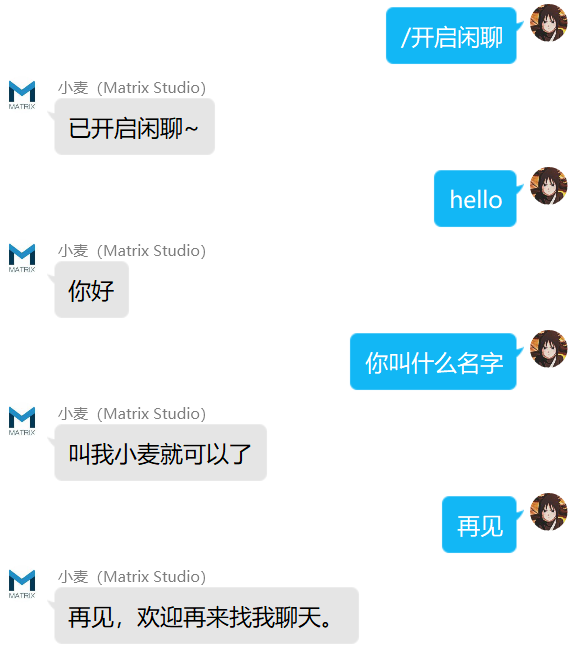

# nonebot_plugin_tuling

✨ NoneBot 图灵机器人 ✨

<a href="./LICENSE">
    
</a>
<a href="https://pypi.python.org/pypi/nonebot_plugin_tuling">
    
</a>


## 📖 介绍

接入图灵机器人做群自动聊天。

## 💿 安装

<details>
<summary>使用 nb-cli 安装</summary>
在 nonebot2 项目的根目录下打开命令行, 输入以下指令即可安装

    nb plugin install nonebot_plugin_tuling

</details>

<details>
<summary>使用包管理器安装</summary>
在 nonebot2 项目的插件目录下, 打开命令行, 根据你使用的包管理器, 输入相应的安装命令

<details>
<summary>pip</summary>

    pip install nonebot_plugin_tuling
</details>
<details>
<summary>conda</summary>

    conda install nonebot_plugin_tuling
</details>

打开 nonebot2 项目的 `bot.py` 文件, 在其中写入

    nonebot.load_plugin("nonebot_plugin_tuling")

</details>

<details>
<summary>从 github 安装</summary>
在 nonebot2 项目的插件目录下, 打开命令行, 输入以下命令克隆此储存库

    git clone https://github.com/Matrix-King-Studio/nonebot_plugin_tuling.git

打开 nonebot2 项目的 `bot.py` 文件, 在其中写入

    nonebot.load_plugin("src.plugins.nonebot_plugin_tuling")

</details>

## ⚙️ 配置

在 nonebot2 项目的`.env`文件中添加下表中的必填配置

| 配置项 | 必填 |  默认值   |                            说明                            |
|:-----:|:----:|:------:|:--------------------------------------------------------:|
| config_path | 否 | 插件安装目录 |                           分群配置                           |
| tu_ling_apikey | 否 |   无    | 在[图灵机器人](http://www.turingapi.com/)创建一个机器人，获取apikey，支持列表 |

```shell
# 图灵机器人
tu_ling_apikey=["*******", "*******", "*******"]
```

## 🎉 使用

### 指令表

|    指令    | 权限 | 需要@ | 范围 |
|:--------:|:----:|:----:|:----:|
|  /开启闲聊   | 群员 | 否 | 群聊 |
|  /关闭闲聊   | 群员 | 否 | 群聊 |

### 效果图


